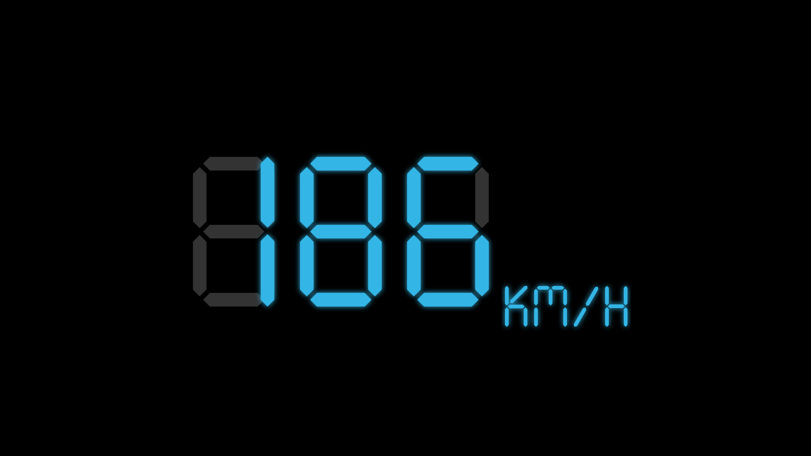
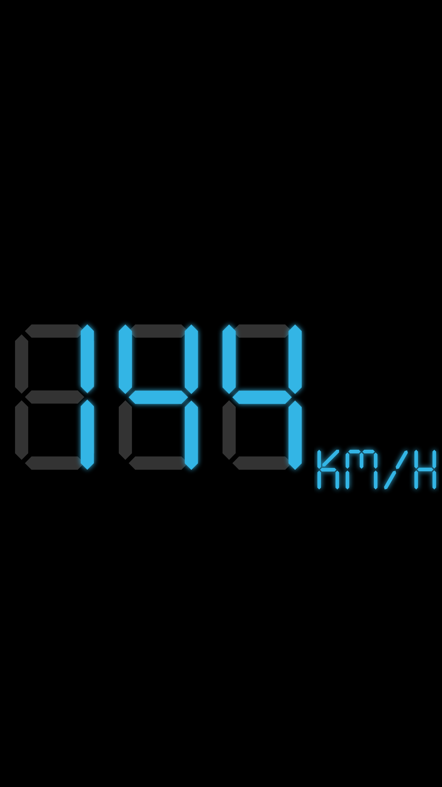

# Digital Speedometer

[](./readmepics/app_screen_landscape.png)

[](./readmepics/app_screen_portrait.png)

Project where speed values are generated in background in the Service (`SpeedValuesService`). Then values are sent to Activity (`MainActivity`), that has fullscreen custom digital speedometer view (`DigitalSpeedometerView`).
While app is running, device screen won't turn of.

This project shows using:
1. AIDL interfaces (Android Interface Definition Language) for interaction between `SpeedValuesService` and `MainActivity`, where service is generating speed values, based on time-dependent periodic function (sum of sinuses).

In `SpeedValuesService` aidl interface `ISpeedValuesBinder`'s method ` registerCallback(listener: IOnSpeedChangedListener)` register listener that is implemented in `MainActivity` and send new speed values to it.

In `MainActivity` implemented `IOnSpeedChangedListener` that listens to speed values changes from service and shows it on view `binding.speedometerView.updateSpeed(newSpeed)`.

2. Custom view, that is based on ConstraintLayout, as the digital speedometer.
    ```<com.melkonian.digitalspeedometer.DigitalSpeedometerView`
        android:id="@+id/speedometerView"
        android:layout_width="0dp"
        android:layout_height="0dp"
        app:backgroundDrawable="@drawable/bg_speedometer_view"
        app:layout_constraintBottom_toBottomOf="parent"
        app:layout_constraintLeft_toLeftOf="parent"
        app:layout_constraintRight_toRightOf="parent"
        app:layout_constraintTop_toTopOf="parent"
        app:speedTextColor="@android:color/holo_blue_light"
        app:speedUnit="kmh"
        app:unitTextColor="@android:color/holo_blue_light" />```

From `.xml` you can change some parameters:
- `speedTextColor`
- `unitTextColor`
- `bgColor`
- `speedTextSize`
- `unitTextSize`
- `speedUnit`: choose between "kmh" and "mph"
- `speedValue`
- `backgroundDrawable`
- `disableBackgroundImage`
- `showUnit`

3. `SpeedValuesService` extends `LifecycleService` for using `lifecycleScope` for launching coroutines to calculate and new speed values (using Dispatchers.Default).
